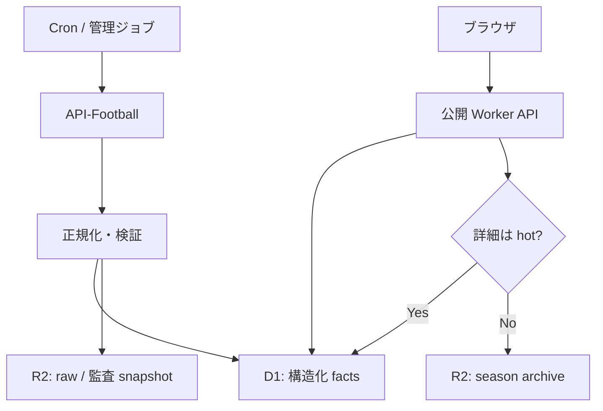
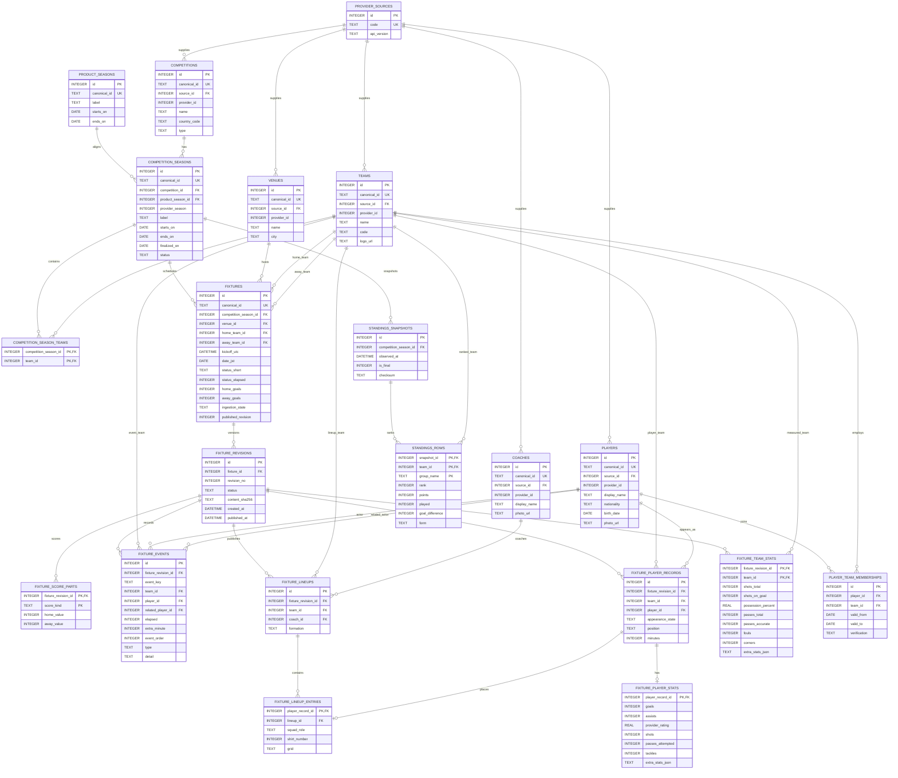
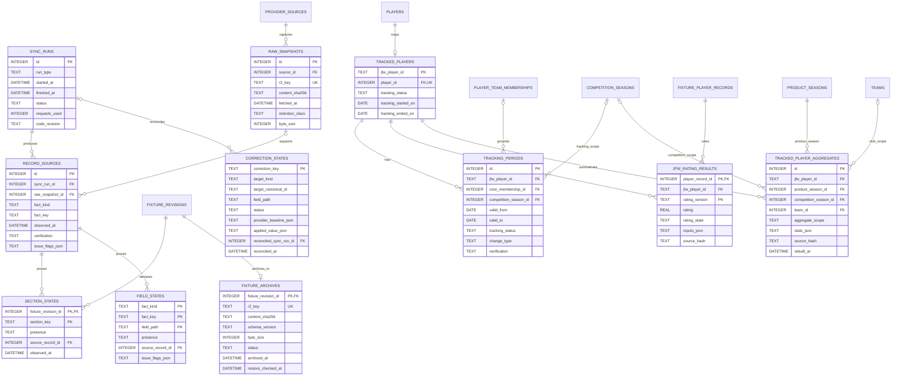

# D1 / R2 データ設計 v1.0（レビュー案）

状態: **Proposed — Claude レビュー完了まで実装禁止**
対象: Data App v2
作成日: 2026-08-26
関連文書: `data-app-v2-direction.md`、`data-contract-v2.md`、`player-tracking-data-model-v1.0.md`

## 1. 結論

構造化されたサッカーデータの正本を Cloudflare D1 に置き、R2 は次の用途に限定する。

- API-Football の生レスポンスと監査用スナップショット
- ホット期間を過ぎた試合詳細の圧縮アーカイブ
- D1 へ復元できるシーズン manifest と checksum

公開アクセスを起点に API-Football を呼ばない。API-Football への取得は Cron または管理用ジョブだけが行い、公開 Worker は D1/R2 に保存済みのデータだけを返す。したがって、閲覧者が増えても API-Football のリクエスト枠は直接消費されない。

既存の v2 DTO、`af:*` の公開 ID、UTC/JST 規則、および「未取得を 0 にしない」規則は維持する。変更するのは保存層と取得経路であり、画面側のデータ契約ではない。

### 既存仕様との優先関係

この文書が承認・実装された時点で、`data-contract-v2.md` と `state/product_scope_v2.json` のうち次の runtime storage 項目だけを置き換える。

- machine facts の正本: R2 → D1
- hot index/cache の必須正本: KV/R2 index → D1 query（edge cache は継続可）
- live mode: demand-driven provider fetch → scheduled ingest + D1 read
- 古い fixture detail: R2 canonical archive として継続

ID、DTO、time zone、missing、補正、tracking overlay の規則は置き換えない。Phase 3 の endpoint 切替までは現行 R2/JSON 経路が runtime の正本であり、このレビュー案だけを理由に既存設定やテストを先に変更しない。

## 2. 設計原則

1. **Core が試合の事実を一度だけ所有する。** 日本人追跡機能は Core の選手・試合・成績を参照し、同じゴール数や出場時間を複製しない。
2. **公開 ID と内部キーを分ける。** DTO は従来どおり `af:fixture:123` などを返し、D1 内の高頻度 JOIN は `INTEGER` 主キーを使う。
3. **不明と 0 を分ける。** 数値の `0` は確認済みの値、`NULL` は値なしである。取得状態は `section_states` と `field_states` で補足する。
4. **人手補正の定義は Git に残す。** D1 は適用・照合状態を保持するが、レビュー可能な補正定義そのものを DB だけに閉じ込めない。
5. **派生値は再構築可能にする。** 順位表の最新表示、追跡集計、JFW Rating はキャッシュ/派生テーブルとして持てるが、元の Core facts から再生成できなければならない。
6. **アーカイブは透過的に読む。** 画面はホット/アーカイブを意識せず同じ fixture endpoint を利用する。
7. **移行は比較可能かつ可逆にする。** JSON と D1 の二重読み取り期間を設け、DTO の byte-level ではなく意味的同値を検証してから切り替える。

## 3. 保存層の分担

| データ | D1 | R2 | Git |
|---|---:|---:|---:|
| 大会、シーズン、クラブ、選手、監督 | 正本・恒久 | 生レスポンスのみ | 設定のみ |
| 試合メタデータ、状態、スコア | 正本・恒久 | 最終 raw / 監査コピー | なし |
| 直近3シーズンのイベント、ラインナップ、詳細スタッツ | 正本 | raw / バックアップ | なし |
| 4シーズン前以前の試合詳細 | 検索用ポインタのみ | 圧縮正本 | なし |
| 順位表 | 最新/最終を構造化保存 | 履歴 snapshot | なし |
| 日本人追跡 ID、所属履歴 | 正本・恒久 | 監査コピー任意 | 登録・運用方針 |
| 人手補正 | 適用/照合状態 | 根拠 snapshot | 補正定義の正本 |
| JFW Rating | 派生結果 | 入力監査 snapshot 任意 | アルゴリズム/版 |
| 個人のフォロー、テーマ | 認証導入後に検討 | なし | なし |

個人設定は認証がない段階ではブラウザの `localStorage` に残す。全利用者で共有すべきサッカーの事実だけを先に D1 へ一元化する。匿名端末 ID で個人設定を D1 に保存する設計は、乗っ取り・同期競合・削除要求を扱えないため採用しない。

## 4. 全体構成



### 実行境界

- 取得ジョブだけが `API_FOOTBALL_KEY` を参照できる。
- 公開 Worker に API-Football への demand fetch 経路を置かない。
- D1 と R2 はブラウザへ直接公開しない。
- 公開 Worker は Origin 制限、応答キャッシュ、IP 単位の緩い rate limit を持つ。
- 正規化は共有モジュールとして一箇所に置き、Cron と移行ツールで同じ実装を使う。

## 5. Core ER

高頻度テーブルは内部 `INTEGER` 主キーを使う。外部公開するエンティティには `canonical_id` を持たせ、既存 DTO の `af:*` ID を変えない。

図中の `DATE` / `DATETIME` は論理型である。物理 DDL では UTC timestamp を ISO 8601 `TEXT`、JST index date を `YYYY-MM-DD` の `TEXT`、真偽値を `INTEGER 0/1` とし、`CHECK` 制約で形式と列挙値を守る。



### Core テーブルの補足

- `canonical_id` と `(source_id, provider_id)` はそれぞれ一意制約を持つ。
- `FIXTURES` はスコアと検索に必要な小さいメタデータを恒久保持する。ハーフタイム、延長、PK などの追加スコアは revision に紐づく `fixture_score_parts` 子テーブルに格納する。
- detail 子行はすべて `FIXTURE_REVISIONS` に属する。公開 query は `FIXTURES.published_revision` と一致する revision だけを読み、分割 ingest の途中状態を表示しない。
- revision 状態は `staging`、`published`、`superseded`、`archived`。`UNIQUE(fixture_id, revision_no)` と公開前 integrity check で、fixture の pointer が同じ fixture の実在 revision だけを指すことを保証する。
- `PRODUCT_SEASONS` は `seasons.json` のアプリ共通シーズン、`COMPETITION_SEASONS` は既存の `af:season:{competition}:{year}` を表す。春秋制/秋春制の大会シーズンを、必要な場合だけアプリ共通シーズンへ対応付ける。
- `FIXTURE_PLAYER_RECORDS.appearance_state` は `started`、`substitute_used`、`bench_unused`、`absent_confirmed`、`unknown` のいずれかとする。lineup が未取得でも確認済み欠場を表現でき、単に stats 行がないことを欠場と解釈しない。
- `FIXTURE_LINEUP_ENTRIES` は formation 上の位置だけを所有する。player stats だけ取得できた場合も `FIXTURE_PLAYER_RECORDS` を作成できる。
- ER 図の stat 列は代表例である。実装 DDL は `state/workflow_policy.json` の `playerDataPolicy.fields` と v2 必須 team stats を型付き列として網羅する。
- `extra_stats_json` は provider 固有で表示・検索に使わない追加フィールドだけに限定する。v2 の必須項目をそこへ逃がさない。
- `PLAYER_TEAM_MEMBERSHIPS` は全選手に使える Core の所属事実であり、追跡可否とは独立する。
- API-Football event には安定した event ID がないため、正規化後の順序と内容から fixture revision 内で決定的な `event_key` を作る。同一時刻・同一種別の別イベントを潰さないよう ordinal を含める。
- イベントに player ID がない場合もあるため、`player_id` と `related_player_id` は nullable とする。
- 順位表の表示は最新 snapshot を使い、シーズン終了後に最終 snapshot を恒久保持する。高頻度の中間 snapshot は R2 へ移せる。

## 6. 状態・来歴・追跡 ER



### 状態表の規則

- `section_states.presence`: `present`、`present_empty`、`not_fetched`、`provider_unavailable`、`not_applicable`。
- `field_states` は通常値には行を作らず、欠落・非該当・競合などを明示する必要があるフィールドだけを疎に保持する。
- `NULL` の値と `field_states` を合わせて解釈する。`NULL` だけを 0 や欠場へ変換してはならない。
- `record_sources.fact_kind + fact_key` は多態参照であるため DB 外部キーを張らない。`fact_key` は restore 後も変わらない canonical ID または canonical composite key とし、内部 row ID を使わない。その代わり ingest 時のバリデータと整合性テストで参照先を必須確認する。
- `TRACKING_PERIODS` は「その期間を自動追跡するか」を所有し、実際の所属クラブは Core の `PLAYER_TEAM_MEMBERSHIPS` を参照する。legacy `membershipHistory` は import 時に Core membership と tracking period へ分解する。
- Core membership と tracking period の期間重複は DB の単純な `CHECK` だけでは防げない。更新トランザクション内の重複検査とテストを必須にする。
- `TRACKED_PLAYER_AGGREGATES` は `season`、`competition`、`club`、`club_competition` の4粒度を持ち、Core facts または確認済み baseline から再構築する。
- JFW Rating の `rating = NULL` と `rating_state = missing/not_applicable` を有効な 0 と混同しない。

## 7. 主な一意制約と index

| テーブル | 制約 / index | 用途 |
|---|---|---|
| `fixtures` | `UNIQUE(canonical_id)` | 公開 ID の一意性 |
| `fixtures` | `INDEX(date_jst, kickoff_utc)` | 日付別試合一覧 |
| `fixtures` | `INDEX(competition_season_id, date_jst, kickoff_utc)` | 大会別日付一覧 |
| `fixtures` | `INDEX(status_short, date_jst)` | LIVE 一覧 |
| `fixtures` | `INDEX(home_team_id, kickoff_utc)`、`INDEX(away_team_id, kickoff_utc)` | クラブ試合履歴 |
| `fixture_revisions` | `UNIQUE(fixture_id, revision_no)` | revision の一意性 |
| `fixture_events` | `UNIQUE(fixture_revision_id, event_key)` | 再取得時の冪等 upsert |
| `fixture_events` | `INDEX(fixture_revision_id, elapsed, event_order)` | 時系列表示 |
| `fixture_lineups` | `UNIQUE(fixture_revision_id, team_id)` | 1 revision・1クラブ・1 lineup |
| `fixture_player_records` | `UNIQUE(fixture_revision_id, team_id, player_id)` | revision 内の選手重複防止 |
| `fixture_player_records` | `INDEX(player_id, fixture_id)` | 選手試合履歴 |
| `fixture_lineup_entries` | `UNIQUE(lineup_id, player_record_id)` | lineup 重複防止 |
| `player_team_memberships` | `INDEX(player_id, valid_from, valid_to)` | 日付時点の所属解決 |
| `standings_snapshots` | `UNIQUE(competition_season_id, observed_at)` | snapshot 冪等性 |
| `section_states` | `PRIMARY KEY(fixture_revision_id, section_key)` | section 状態一意性 |
| `tracking_periods` | `INDEX(jfw_player_id, valid_from, valid_to)` | 日付時点の追跡可否解決 |
| `fixture_archives` | `UNIQUE(r2_key)` | archive ポインタ一意性 |

D1 の row-read 課金を抑えるため、公開 endpoint の `WHERE` と `ORDER BY` に対応しない全表走査を許可しない。実装時は代表クエリへ `EXPLAIN QUERY PLAN` の自動テストを追加する。

## 8. 3シーズン保持と archive

### 保持ルール

- **Hot:** 現行シーズン + 直前2シーズンの詳細を D1 に保持する。
- **Archive:** 4シーズン前以降のイベント、ラインナップ、選手/クラブ詳細スタッツを R2 に移す。
- シーズン終了直後には移さず、`competition_seasons.finalized_on + 90日` を過ぎてから対象にする。
- 大会、シーズン、チーム、選手、追跡 ID、所属履歴、compact fixture、最終スコア、最終順位、補正状態、archive pointer は D1 に恒久保持する。
- D1 使用量が **350 MB** を超えた場合は、500 MB 上限への安全余白を守るため、終了済みで最も古い詳細シーズンを前倒し archive する。

「3シーズン」は大会ごとの `competition_seasons` で判定し、各大会の現行 + 直前2シーズンを基準にする。秋春制と春秋制が混在するため、単純な年差では削除しない。350 MB の容量保護はこの hot window より優先できるが、fixture endpoint は R2 fallback により維持する。

### R2 キー

```text
archive/v1/competitions/{competitionId}/seasons/{seasonId}/fixtures/{fixtureId}/{contentSha256}.json.gz
archive/v1/competitions/{competitionId}/seasons/{seasonId}/manifests/{manifestSha256}.json
raw/v1/api-football/{yyyy}/{mm}/{dd}/{endpoint-hash}/{fetchedAt}.json.gz
evidence/v1/corrections/{correctionKey}/{contentSha256}.json.gz
```

fixture archive は response-ready な完全 v2 fixture bundle と、復元に必要な section/field state・provenance を canonical ID で含む。内部 `INTEGER` ID は保存せず、再 import 時に解決する。manifest は fixture ID、revision、object key、byte size、SHA-256、schema version、作成時刻、件数を持つ。

object key に content hash を含め、既存 archive を上書きしない。archive 後の補正は新しい revision と object を生成し、D1 の公開 revision を新 object へ切り替える。旧 object は監査用に残す。

### archive 手順

1. 対象シーズンを read-only にし、対象 fixture の公開 revision と detail 子行の集合を固定する。
2. fixture ごとに canonical JSON を生成し、gzip 圧縮、SHA-256 を計算する。
3. R2 へ content-addressed fixture object を書く。
4. 全 object を再読込して checksum、件数、schema version を検証した後、content-addressed season manifest を書いて再検証する。
5. fixture ごとの D1 `batch()` transaction で `fixture_archives(status = archived)` の登録、revision 状態の `archived` 化、その revision の detail 子行削除を一括する。
6. batch が失敗した fixture は全変更が rollback されたことを確認し、冪等に再実行する。
7. 無作為サンプルと追跡対象選手を含む全 fixture を Worker endpoint 経由で復元比較する。

R2 書込みや検証に失敗した場合、D1 の detail は削除しない。D1 削除後に問題が見つかった場合も、恒久 master/compact fixture export を seed した clean test DB へ manifest と archive から detail を再 import できることを archive コマンドの受入条件とする。

### raw snapshot の寿命

- LIVE 中の一時 raw: 14日
- 最終取得 raw: fixture archive に同梱または恒久 evidence として保持
- 失敗解析、競合、人手補正の根拠 raw: 解決後も恒久保持
- 同一内容の raw は SHA-256 で重複排除する

## 9. 読み取りと API 互換性

既存 endpoint は維持する。

| Endpoint | D1 の主クエリ | archive fallback |
|---|---|---|
| `GET /api/v2/live` | `fixtures(status_short, date_jst)` | なし |
| `GET /api/v2/dates/{date}` | `fixtures(date_jst, kickoff_utc)` | 不要（compact は恒久） |
| `GET /api/v2/competitions/{id}/dates/{date}` | `competition_seasons + fixtures` | 不要 |
| `GET /api/v2/fixtures/{fixtureId}` | fixture と hot detail を JOIN | `fixture_archives.r2_key` |
| `GET /api/v2/competitions/{id}/seasons/{seasonId}/standings` | 最新/最終 snapshot | 必要なら履歴のみ R2 |

新画面で追加する endpoint は `screen-flow-v2-d1-v1.0.md` に定義する。hot read は `data-contract-v2.md` の DTO builder を通し、archive は同じ builder で事前生成・検証した response-ready bundle を保存する。内部 D1 row をそのまま公開しない。

archive fallback の流れは次のとおり。

1. compact fixture を D1 から取得する。
2. hot detail が存在すれば D1 から DTO を構築する。
3. detail がなく `fixture_archives` があれば、R2 object metadata の schema version と事前検証済み checksum を pointer と照合し、gzip の response-ready bundle を stream する。
4. pointer もなければ、section state を維持した compact response または明示的な `404 detail_not_available` を返す。

完了済み fixture は revision/content hash を ETag に使う。archive object は immutable とし、長い `s-maxage` を設定する。LIVE と当日一覧は短い TTL、過去日一覧は長い TTL にし、同一 URL の D1/R2 read を抑える。

## 10. Cloudflare free 枠と負荷ガード

2026-08-26 時点の設計前提を次に固定する。料金・上限は実装開始時にも公式文書で再確認する。

| 対象 | Free の主な上限 | この設計での対応 |
|---|---|---|
| Workers | 100,000 requests/日、通常 invocation 10 ms CPU | 公開 read を小さくし、archive は parse せず stream |
| D1 | 5M rows read/日、100k rows written/日 | index、bounded query、差分 revision だけを書込む |
| D1 database | 500 MB/DB、5 GB/account | 350 MB 警告、3シーズン archive |
| D1 Free invocation | 最大50 queries/Worker invocation | 公開 read は原則1〜3 query、ingest は generation 単位で chunk |
| R2 Standard | 10 GB-month、Class A 1M/月、Class B 10M/月 | immutable object、edge cache、重複排除 |

閲覧者のアクセスは **Workers の request 枠を消費する**。cache hit でも Worker request として数えられる構成があるため、「誰が見ても無料枠が減らない」とは扱わない。一方、公開 read から provider を切り離すため、閲覧だけで API-Football quota は減らない。

公開 API には次を必須とする。

- route と query parameter の allowlist、日付範囲、page size、cursor の上限
- `GET` 応答の edge cache と request coalescing
- LIVE/当日/過去/immutable archive ごとの明示 TTL
- IP 単位の rate limit と異常トラフィックの global circuit breaker
- Workers、D1 row read/write、R2 operations の 70% 警告と 85% 保護モード
- 高コスト endpoint の query-count/rows-read 計測

Origin allowlist はブラウザ互換と雑な abuse の軽減には使えるが、認証や課金防御の境界ではない。公開データ endpoint は Origin を偽装できる前提で、入力上限・cache・rate limit を実装する。

参考:

- [Workers pricing](https://developers.cloudflare.com/workers/platform/pricing/)
- [D1 pricing](https://developers.cloudflare.com/d1/platform/pricing/)
- [D1 limits](https://developers.cloudflare.com/d1/platform/limits/)
- [D1 batch transaction](https://developers.cloudflare.com/d1/worker-api/d1-database/#batch)
- [R2 pricing](https://developers.cloudflare.com/r2/pricing/)
- [R2 consistency](https://developers.cloudflare.com/r2/reference/consistency/)

## 11. 同期と quota

- LIVE 対象の provider 取得頻度は閲覧数ではなく schedule と試合状態で決める。
- 一例として、試合開始前後だけ短い間隔、通常日は長い間隔にする。正確な間隔は API-Football 契約枠と対象大会数を使って実装前に予算化する。
- `sync_runs` に provider request 数、quota headers、開始/終了、失敗理由を記録する。
- `configuredDailyBudget`、reserve、soft stop を取得ジョブで強制し、公開 Worker から bypass できないようにする。
- 同じ fixture/revision の再取得は `batch()` transaction 内の upsert と一意制約で冪等にする。
- 新しい revision の detail を `staging` 状態で複数 chunk に分けて書き、全件検証後の最終 `batch()` だけが compact fixture と `published_revision` を切り替える。公開 query は staging revision を読まない。
- Free の50 query/invocation と100 bound parameters/query を超えないよう、multi-row statement と chunk checkpoint を使う。途中失敗は同じ staging revision から再開する。
- 新しい canonical bundle の content hash が公開 revision と同じなら書込みを省略し、D1 row-write を消費しない。
- 初期実装では既存の GitHub Actions を取得・正規化 writer として利用できる。Worker Cron は UTC schedule、CPU、query 数を計測して free 上限内と確認できた場合だけ置き換える。

## 12. 補正と provenance

補正の宣言はレビュー可能な JSON/コードとして Git に残す。D1 の `correction_states` は次を記録する。

- 補正キーと対象 path
- 補正時に観測した provider baseline
- 適用値
- `active`、`provider_caught_up`、`review_required` の状態
- 最後に照合した sync run

再取得時の規則は既存 contract と同じである。

- provider 値が baseline のまま: 補正を適用し `active`
- provider が補正値に追いついた: provider 値を採用し `provider_caught_up`
- provider が別の値へ変わった: 自動上書きせず `review_required`

表示 DTO には既存の `overrides` と `fieldIssues` を再構築する。DB 内の補正状態だけを唯一の根拠にせず、Git の定義と D1 状態の不一致を CI で検出する。

## 13. 移行計画と gate

### Phase 0 — 設計レビュー

- 本文書と画面遷移文書を Claude がレビューする。
- `BLOCKER` と `MAJOR` が 0 になるまで schema、Worker、画面の実装を開始しない。

### Phase 1 — schema とローカル変換

- D1 migration、型付き repository、DTO builder を追加する。
- 現行 JSON をローカル D1 へ import する一回限りの変換器を作る。
- 全 FK、ID、section state、追跡 membership、aggregate invariants を検証する。

### Phase 2 — shadow read

- 本番表示は既存 JSON/R2 のまま維持する。
- CI と管理ジョブで JSON 経路と D1 経路の DTO を比較する。
- 順序、日時表記、nullable、0、補正状態を正規化した上で意味的同値を確認する。

### Phase 3 — endpoint 単位の切替

1. date / competition indexes
2. standings
3. fixture detail
4. live
5. tracking aggregates

各 endpoint は feature flag で旧経路へ戻せるようにし、切替後も最低7日間 shadow compare を続ける。

### Phase 4 — archive 有効化

- archive dry-run、export、checksum、restore test を通す。
- 最初の1シーズンを archive し、全 fixture endpoint の同値を確認する。
- その後に定期 rollover を有効化する。

### Phase 5 — legacy JSON の縮退

D1 が正本になり、追跡・画面・snapshot の parity が確認された後に限り、分割 backfill JSON の runtime merge を停止する。監査用 release snapshot の生成を続けるかは別 ADR で決める。

## 14. 受入条件

- 既存全テストが fail 0 のまま。
- D1 import 後の全公開 ID が現行 DTO と一致する。
- 既知の全 fixture でスコア、状態、JST 日付、section presence が一致する。
- 明示的な 0 と欠落値を区別する contract test が D1 経路でも通る。
- transfer 前後で同一 JFW player ID が維持され、過去クラブの成績が現在クラブへ移らない。
- 人手補正の3状態が再取得後も既存挙動と一致する。
- hot fixture と archive fixture が同じ endpoint/DTO で取得できる。
- archive 後に、恒久 master/compact fixture を seed した clean test DB へ manifest から詳細を復元できる。
- 代表クエリが index を使い、公開 endpoint に意図しない全表走査がない。
- 公開アクセスを増やしても API-Football request counter が増えない。
- D1 350 MB 警告と archive 前倒し判定をテストできる。

## 15. 今回決めないこと

- ユーザー認証と端末間 follow 同期
- 通知配信基盤
- API-Football 以外の provider 統合
- analytics 用 warehouse
- archive の法的保持年限（運用実績を見て別途決定）

これらは Core facts の D1 移行を妨げない独立課題として扱う。
