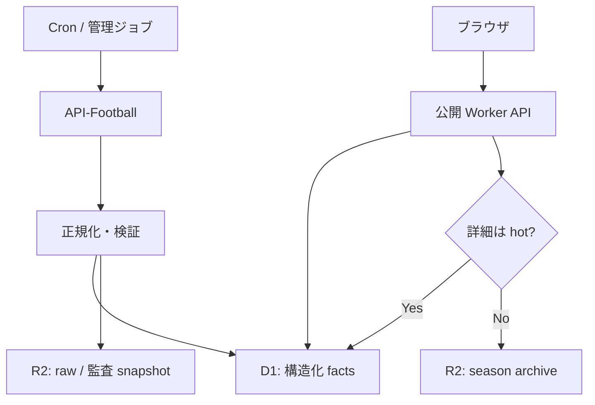
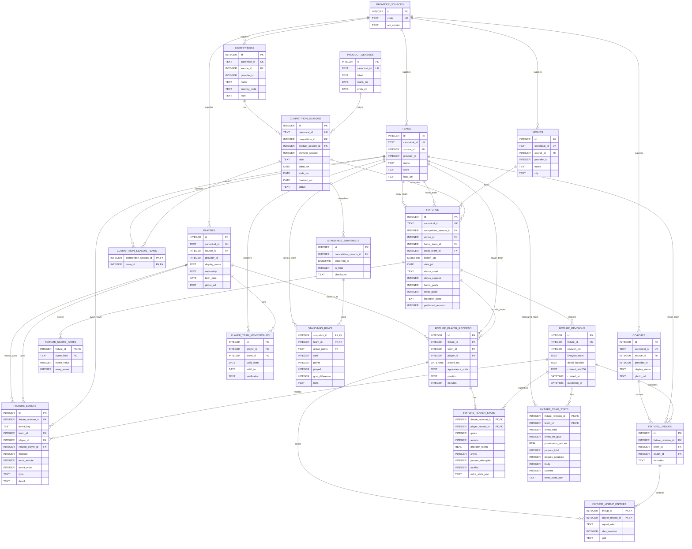
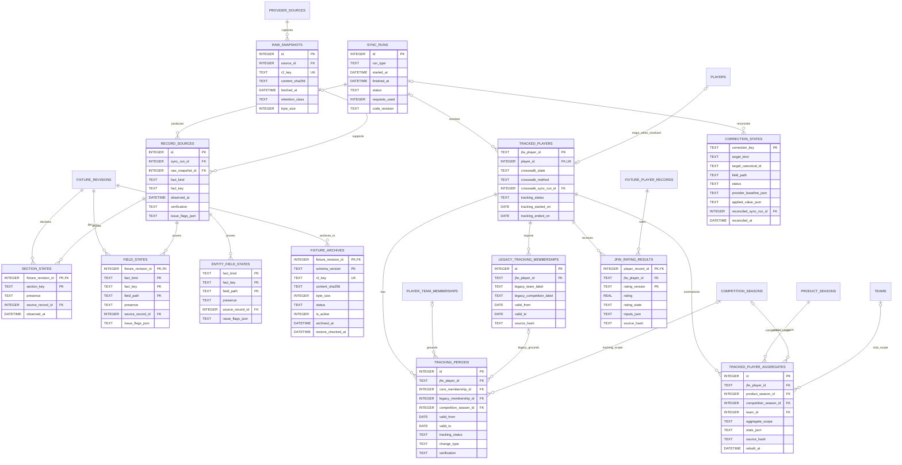

# D1 / R2 データ設計 v1.1（再々レビュー案）

状態: **Proposed — Claude レビュー完了まで実装禁止**
対象: Data App v2
作成日: 2026-08-26
関連文書: `data-app-v2-direction.md`、`data-contract-v2.md`、`player-tracking-data-model-v1.0.md`、`ui-wireframe-baseline-v1.0.md`

## 1. 結論

構造化されたサッカーデータの正本を Cloudflare D1 に置き、R2 は次の用途に限定する。

- API-Football の生レスポンスと監査用スナップショット
- ホット期間を過ぎた試合詳細の圧縮アーカイブ
- D1 へ復元できるシーズン manifest と checksum

公開アクセスを起点に API-Football を呼ばない。API-Football への取得は Cron または管理用ジョブだけが行い、公開 Worker は D1/R2 に保存済みのデータだけを返す。したがって、閲覧者が増えても API-Football のリクエスト枠は直接消費されない。

既存の v2 DTO、`af:*` の公開 ID、UTC/JST 規則、および「未取得を 0 にしない」規則は維持する。変更するのは保存層と取得経路であり、画面側のデータ契約ではない。

### 既存仕様との優先関係

この文書が承認・実装された時点で、`data-contract-v2.md` と `state/product_scope_v2.json` のうち次の runtime storage 項目だけを置き換える。

- machine facts の正本: R2 → D1
- hot index/cache の必須正本: KV/R2 index → D1 query（edge cache は継続可）
- live mode: demand-driven provider fetch → scheduled ingest + D1 read
- 古い fixture detail: R2 canonical archive として継続

ID、DTO、time zone、missing、補正、tracking overlay の規則は置き換えない。Phase 3 の endpoint 切替までは現行 R2/JSON 経路が runtime の正本であり、このレビュー案だけを理由に既存設定やテストを先に変更しない。

## 2. 設計原則

1. **Core が試合の事実を一度だけ所有する。** 日本人追跡機能は Core の選手・試合・成績を参照し、同じゴール数や出場時間を複製しない。
2. **公開 ID と内部キーを分ける。** DTO は従来どおり `af:fixture:123` などを返し、D1 内の高頻度 JOIN は `INTEGER` 主キーを使う。
3. **不明と 0 を分ける。** 数値の `0` は確認済みの値、`NULL` は値なしである。取得状態は `section_states` と `field_states` で補足する。
4. **人手補正の定義は Git に残す。** D1 は適用・照合状態を保持するが、レビュー可能な補正定義そのものを DB だけに閉じ込めない。
5. **派生値は再構築可能にする。** 順位表の最新表示、追跡集計、JFW Rating はキャッシュ/派生テーブルとして持てるが、元の Core facts から再生成できなければならない。
6. **アーカイブは透過的に読む。** 画面はホット/アーカイブを意識せず同じ fixture endpoint を利用する。
7. **移行は比較可能かつ可逆にする。** JSON と D1 の二重読み取り期間を設け、DTO の byte-level ではなく意味的同値を検証してから切り替える。

## 3. 保存層の分担

| データ | D1 | R2 | Git |
|---|---:|---:|---:|
| 大会、シーズン、クラブ、選手、監督 | 正本・恒久 | 生レスポンスのみ | 設定のみ |
| 試合メタデータ、状態、スコア | 正本・恒久 | 最終 raw / 監査コピー | なし |
| 直近3シーズンのイベント、ラインナップ、詳細スタッツ | 正本 | raw / バックアップ | なし |
| 3シーズン前以前（N-3 以前）の試合詳細 | compact・検索用情報のみ | 圧縮正本 | なし |
| 順位表 | 最新/最終を構造化保存 | 履歴 snapshot | なし |
| 日本人追跡 ID、所属履歴 | 正本・恒久 | 監査コピー任意 | 登録・運用方針 |
| 人手補正 | 適用/照合状態 | 根拠 snapshot | 補正定義の正本 |
| JFW Rating | 派生結果 | 入力監査 snapshot 任意 | アルゴリズム/版 |
| 個人のフォロー、テーマ | 認証導入後に検討 | なし | なし |

個人設定は認証がない段階ではブラウザの `localStorage` に残す。ただし legacy の視聴済み fixture ID は新 UI へ移行せず、時点ごとの視聴価値ランキングへ置き換える。全利用者で共有すべきサッカーの事実だけを先に D1 へ一元化する。匿名端末 ID で個人設定を D1 に保存する設計は、乗っ取り・同期競合・削除要求を扱えないため採用しない。

## 4. 全体構成



### 実行境界

- 取得ジョブだけが `API_FOOTBALL_KEY` を参照できる。
- 公開 Worker に API-Football への demand fetch 経路を置かない。
- D1 と R2 はブラウザへ直接公開しない。
- 公開 Worker は Origin 制限、応答キャッシュ、IP 単位の緩い rate limit を持つ。
- 正規化は共有モジュールとして一箇所に置き、Cron と移行ツールで同じ実装を使う。
- GitHub Actions は取得・正規化と admin ingest endpoint の呼出しだけを行う。D1 の staging/publish は D1 binding を持つ admin Worker だけが実行し、公開 Worker には write binding を与えない。
- admin ingest token は GitHub Actions の environment secret に置き、対象 repository・environment・admin endpoint だけへ絞る。Cloudflare deploy token は Worker/D1/R2 の対象 resource だけへ scope を限定し、データ publish 用には使わない。

## 5. Core ER

高頻度テーブルは内部 `INTEGER` 主キーを使う。外部公開するエンティティには `canonical_id` を持たせ、既存 DTO の `af:*` ID を変えない。

図中の `DATE` / `DATETIME` は論理型である。物理 DDL では UTC timestamp を ISO 8601 `TEXT`、JST index date を `YYYY-MM-DD` の `TEXT`、真偽値を `INTEGER 0/1` とし、`CHECK` 制約で形式と列挙値を守る。複合 `PRIMARY KEY` の全構成列には明示的な `NOT NULL` を付けるか、該当テーブルを `WITHOUT ROWID` にする。nullable な値を複合 PK に含めず、`STANDINGS_ROWS.group_name` はグループなしを空文字 `''` で表す。



### Core テーブルの補足

- `canonical_id` と `(source_id, provider_id)` はそれぞれ一意制約を持つ。
- `FIXTURES` と `FIXTURE_SCORE_PARTS` はスコアと検索に必要な fixture scope の compact データとして恒久保持する。`FIXTURE_SCORE_PARTS` の PK は `(fixture_id, score_kind)` とし、公開 pointer 切替時に最新の halftime/fulltime/extratime/penalty を同じ transaction で upsert する。revision 行へ結び付けず、superseded/archive cleanup の対象にも含めない。
- detail 子行と `SECTION_STATES` / `FIELD_STATES` は `FIXTURE_REVISIONS` に属する。公開 query は `FIXTURES.published_revision` と一致し、`lifecycle_state != 'staging'` の revision だけを読み、section/field state を含む分割 ingest の途中状態を表示しない。
- revision は lifecycle と保存場所を分離する。`lifecycle_state` は `staging`、`published`、`superseded`、`detail_location` は `d1`、`r2`。`UNIQUE(fixture_id, revision_no)` と公開前 integrity check で、fixture の pointer が同じ fixture の実在 revision だけを指すことを保証する。
- `PRODUCT_SEASONS.canonical_id` は `jfw:season:{label}`（例: `jfw:season:2026-27`）、`COMPETITION_SEASONS.canonical_id` は既存の `af:season:{competition}:{year}` とする。両 ID は別 namespace として扱い、春秋制/秋春制の大会シーズンを必要な場合だけアプリ共通シーズンへ対応付ける。
- `FIXTURE_PLAYER_RECORDS` は revision scope ではなく fixture scope とし、`UNIQUE(fixture_id, team_id, player_id)` で1選手1試合1クラブの恒久 record を持つ。`appearance_state`、`position`、`minutes` の公開値だけを最終 publish transaction で更新し、revision 固有の詳細 stat は `FIXTURE_PLAYER_STATS(fixture_revision_id, player_record_id)` に閉じる。これにより公開 revision ごとに全選手 record を複製したり `is_published` を反転したりしない。
- `FIXTURE_PLAYER_STATS` と `FIXTURE_LINEUP_ENTRIES` の player record は、参照する revision/lineup と同じ fixture に属さなければならない。個別FKだけではこの同一fixture条件を表せないため、staging完成時とpublish直前のintegrity validatorで必須検証し、不一致を含むbatchをrollbackする。
- `FIXTURE_PLAYER_RECORDS.appearance_state` は `started`、`substitute_used`、`bench_unused`、`absent_confirmed`、`unknown` のいずれかとする。lineup が未取得でも確認済み欠場を表現でき、単に stats 行がないことを欠場と解釈しない。
- `FIXTURE_LINEUP_ENTRIES` は formation 上の位置だけを所有する。player stats だけ取得できた場合も `FIXTURE_PLAYER_RECORDS` を作成できる。
- ER 図の stat 列は代表例である。選手 stat の物理 DDL は `data-contract-v2.md` §6 の `values.*` を正本とし、`scripts/v2/fixture-contract.js` の `normalizePlayerStats` が生成する28項目を型付き列として網羅する。provider 由来でない legacy 追跡語彙は Core 列へ追加せず、下表の規則で tracking 側の派生値または状態として扱う。
- `extra_stats_json` は provider 固有で表示・検索に使わない追加フィールドだけに限定する。v2 の必須項目をそこへ逃がさない。
- `PLAYER_TEAM_MEMBERSHIPS` は全選手に使える Core の所属事実であり、追跡可否とは独立する。
- API-Football event には安定した event ID がないため、正規化後の順序と内容から fixture revision 内で決定的な `event_key` を作る。同一時刻・同一種別の別イベントを潰さないよう ordinal を含める。
- イベントに player ID がない場合もあるため、`player_id` と `related_player_id` は nullable とする。
- 順位表の表示は最新 snapshot を使い、シーズン終了後に最終 snapshot を恒久保持する。高頻度の中間 snapshot は R2 へ移せる。
- `PLAYER_TEAM_MEMBERSHIPS.valid_to` は `NOT NULL DEFAULT '9999-12-31'` とし、無期限を `NULL` で表さない。legacy の `to: null` は import 時に sentinel へ変換する。

### legacy 追跡 stat と Core の対応

| legacy `playerDataPolicy.fields` | Core / tracking での扱い |
|---|---|
| `minutes`, `goals`, `assists`, `shots`, `shotsOnTarget`, `keyPasses`, `tackles`, `interceptions`, `blocks`, `saves`, `duelsWon`, `dribbles`, `dribbledPast`, `yellowCards`, `penaltiesSaved`, `penaltiesConceded` | 同名の Core `values.*` を参照 |
| `duelsTotal`, `passesAttempted` | Core の `duels`, `passes` へ名称変換 |
| `passesCompleted` | provider の `passes` と `passAccuracy` から正確に再現できる場合だけ tracking 派生値を作る。丸めで確定できなければ `provider_missing` |
| `appearance`, `start`, `bench`, `substitution` | `FIXTURE_PLAYER_RECORDS.appearance_state` と lineup/event から tracking 側で派生 |
| `secondYellowRed`, `straightRed`, `ownGoals` | event detail が区別できる場合だけ tracking 側で派生し、Core の集約 card/goals 列とは別管理 |
| `cleanSheets`, `clearances`, `aerialDuelsWon`, `aerialDuelsTotal`, `bigChancesMissed`, `possessionsLost`, `shotsOnTargetFaced`, `highClaims`, `errorsLeadingToGoal`, `gaOnPitch` | 現行 `fixtures/players` 正規化の Core 列にしない。確認済み baseline または別 source がある場合だけ tracking 派生値とし、それ以外は `provider_missing` |

## 6. 状態・来歴・追跡 ER



### 状態表の規則

- D1 内部の `section_states.presence` は `present`、`present_empty`、`not_fetched`、`provider_missing`、`not_applicable`。公開 DTO では `present_empty` を `presence: "present"` と空配列へ写像し、`provider_unavailable` という別名は使わない。既存の4値 enum と「取得済み空と未取得を分ける」意味を維持する。
- fixture 由来の `field_states` は PK `(fixture_revision_id, fact_kind, fact_key, field_path)` とし、通常値には行を作らず、欠落・非該当・競合などを明示する必要があるフィールドだけを疎に保持する。fixture 起点でない master/追跡 fact は revision sentinel を使わず、別の `entity_field_states` に保持する。
- `NULL` の値と `field_states` を合わせて解釈する。`NULL` だけを 0 や欠場へ変換してはならない。
- `record_sources.fact_kind + fact_key` は多態参照であるため DB 外部キーを張らない。`fact_key` は restore 後も変わらない canonical ID または canonical composite key とし、内部 row ID を使わない。その代わり ingest 時のバリデータと整合性テストで参照先を必須確認する。
- `TRACKED_PLAYERS.player_id` は nullable で、`crosswalk_state` は `resolved`、`unresolved`、`ambiguous`。解決済みの場合だけ Core player と1対1になり、`crosswalk_method`（provider ID、reviewed name match、人手）と `crosswalk_sync_run_id` を記録する。名前だけで `af:player:*` を推測せず、未解決のまま import を完了できる。
- `TRACKING_PERIODS` は「その期間を自動追跡するか」を所有する。解決済み所属は Core の `PLAYER_TEAM_MEMBERSHIPS`、名前しかない legacy 所属は tracking 専用の `LEGACY_TRACKING_MEMBERSHIPS` を参照し、Core facts へダミー player/team を発行しない。legacy `membershipHistory` は import 時にいずれかの membership と tracking period へ分解する。
- `TRACKING_PERIODS.core_membership_id` と `legacy_membership_id` は必ずどちらか一方だけを持ち、`CHECK ((core_membership_id IS NULL) <> (legacy_membership_id IS NULL))` を課す。crosswalk が `resolved` になったときは、同一 transaction 内で legacy 参照を Core membership 参照へ付け替えてから commit し、両参照または参照なしの中間状態を公開しない。
- Core membership と tracking period の期間重複は DB の単純な `CHECK` だけでは防げない。更新トランザクション内の重複検査とテストを必須にする。
- `PLAYER_TEAM_MEMBERSHIPS`、`LEGACY_TRACKING_MEMBERSHIPS`、`TRACKING_PERIODS` の `valid_to` は `NOT NULL DEFAULT '9999-12-31'` とし、無期限を `NULL` で表さない。
- `TRACKED_PLAYER_AGGREGATES` は `season`、`competition`、`club`、`club_competition` の4粒度を持ち、Core facts または確認済み baseline から再構築する。archive 済みシーズンを再構築する場合は R2 manifest から対象 bundle を restore/stream して再計算するが、確定済み aggregate 自体は D1 に恒久保持する。
- JFW Rating の `rating = NULL` と `rating_state = missing/not_applicable` を有効な 0 と混同しない。
- `FIXTURE_ARCHIVES.status` は `NOT NULL` かつ `verifying`、`ready`、`superseded`、`quarantined` の4値、`is_active` は `NOT NULL DEFAULT 0 CHECK (is_active IN (0, 1))` とし、`CHECK (is_active = 0 OR status = 'ready')` を課す。PK `(fixture_revision_id, schema_version)` で同じ revision の複数 schema 世代を保持し、`is_active = 1` は revision ごとに最大1行とする。公開 Worker は `status = 'ready' AND is_active = 1` の pointer だけを読む。

## 7. 主な一意制約と index

| テーブル | 制約 / index | 用途 |
|---|---|---|
| `fixtures` | `UNIQUE(canonical_id)` | 公開 ID の一意性 |
| `fixtures` | `INDEX(date_jst, kickoff_utc)` | 日付別試合一覧 |
| `fixtures` | `INDEX(competition_season_id, date_jst, kickoff_utc)` | 大会別日付一覧 |
| `fixtures` | `INDEX(status_short, date_jst)` | LIVE 一覧 |
| `fixtures` | `INDEX(home_team_id, kickoff_utc)`、`INDEX(away_team_id, kickoff_utc)` | クラブ試合履歴 |
| `fixture_revisions` | `UNIQUE(fixture_id, revision_no)` | revision の一意性 |
| `fixture_events` | `UNIQUE(fixture_revision_id, event_key)` | 再取得時の冪等 upsert |
| `fixture_events` | `INDEX(fixture_revision_id, elapsed, event_order)` | 時系列表示 |
| `fixture_lineups` | `UNIQUE(fixture_revision_id, team_id)` | 1 revision・1クラブ・1 lineup |
| `fixture_player_records` | `UNIQUE(fixture_id, team_id, player_id)` | fixture 内の選手重複防止 |
| `fixture_player_records` | `INDEX(player_id, kickoff_utc DESC)` | 選手試合履歴。公開可否は親 fixture の公開 pointer で決める |
| `fixture_player_stats` | `PRIMARY KEY(fixture_revision_id, player_record_id)` | revision 固有 stat の一意性 |
| `fixture_lineup_entries` | `UNIQUE(lineup_id, player_record_id)` | lineup 重複防止 |
| `player_team_memberships` | `INDEX(player_id, valid_from, valid_to)` | 日付時点の所属解決 |
| `standings_snapshots` | `UNIQUE(competition_season_id, observed_at)` | snapshot 冪等性 |
| `section_states` | `PRIMARY KEY(fixture_revision_id, section_key)` | section 状態一意性 |
| `field_states` | `PRIMARY KEY(fixture_revision_id, fact_kind, fact_key, field_path)` | revision 内 field 状態一意性 |
| `entity_field_states` | `PRIMARY KEY(fact_kind, fact_key, field_path)` | master/追跡 field 状態一意性。3列すべて `NOT NULL` |
| `tracking_periods` | `INDEX(jfw_player_id, valid_from, valid_to)` | 日付時点の追跡可否解決 |
| `fixture_archives` | `UNIQUE(r2_key)` | archive ポインタ一意性 |
| `fixture_archives` | `UNIQUE(fixture_revision_id) WHERE is_active = 1` | revision ごとの active pointer を1つに限定 |

D1 の row-read 課金を抑えるため、公開 endpoint の `WHERE` と `ORDER BY` に対応しない全表走査を許可しない。`FIXTURE_PLAYER_RECORDS.fixture_id` と `kickoff_utc` は選手履歴用の意図的な非正規化列である。公開可否は `FIXTURES.published_revision` が同 fixture の `published` revision を指すことだけで決め、player record ごとの公開フラグを持たない。実装時は全 index の参照列が DDL に実在することを静的検証し、代表クエリへ `EXPLAIN QUERY PLAN` の自動テストを追加する。

## 8. 3シーズン保持と archive

### 保持ルール

- **Hot:** 現行シーズン N + 直前2シーズン（N、N-1、N-2）の詳細を D1 に保持する。
- **Archive:** hot に含まれない N-3 以前（3シーズン前以前）のイベント、ラインナップ、選手/クラブ詳細スタッツを R2 に移す。
- シーズン終了直後には移さず、`competition_seasons.finalized_on + 90日` を過ぎてから対象にする。
- 大会、シーズン、チーム、選手、追跡 ID、所属履歴、compact fixture、`fixture_score_parts`、最終順位、補正状態、archive pointer、追跡対象選手の公開中 `fixture_player_records` / `jfw_rating_results` / 確定 aggregate は D1 に恒久保持する。
- D1 使用量が **350 MB** を超えた場合は、500 MB 上限への安全余白を守るため、終了済みで最も古い詳細シーズンを前倒し archive する。

「3シーズン」は大会ごとの `competition_seasons` で判定し、各大会の現行 + 直前2シーズンを基準にする。hot に該当しない確定シーズンはすべて archive 候補となり、対象集合と hot 集合が交差しないことを archive 開始前に assert する。秋春制と春秋制が混在するため、単純な年差では削除しない。350 MB の容量保護はこの hot window より優先できるが、fixture endpoint は R2 fallback により維持する。

### D1 恒久行と archive 削除対象

| 区分 | テーブル / 行 | archive 後 |
|---|---|---|
| compact | `fixtures`、`fixture_score_parts`、最終 `standings_rows`、`entity_field_states` | D1 に保持 |
| tracking | 追跡対象選手の公開中 `fixture_player_records` と対応する `jfw_rating_results`、`tracked_player_aggregates` | D1 に保持 |
| detail | `fixture_events`、`fixture_lineups`、`fixture_lineup_entries`、`fixture_player_stats`、`fixture_team_stats` | R2 検証後に D1 から削除 |
| state/provenance | `section_states`、`field_states`、detail 専用 `record_sources` | R2 bundle に含めた後、D1 から削除。master/追跡用 `entity_field_states` と、それが参照する `record_sources` は削除しない |
| non-tracked appearance | 追跡対象でない `fixture_player_records` | R2 bundle に含めた後、D1 から削除 |

追跡対象選手の恒久 `fixture_player_records` は Rating と過去試合一覧を D1 だけで表示するための最小行であり、lineup entry や player stat detail は保持しない。archive 後の補正で aggregate を再計算するときだけ R2 manifest を読む。

### R2 キー

```text
archive/{schemaVersion}/competitions/{competitionId}/seasons/{seasonId}/fixtures/{fixtureId}/{contentSha256}.json.gz
archive/{schemaVersion}/competitions/{competitionId}/seasons/{seasonId}/manifests/{manifestSha256}.json
raw/v1/api-football/{yyyy}/{mm}/{dd}/{endpoint-hash}/{fetchedAt}.json.gz
evidence/v1/corrections/{correctionKey}/{contentSha256}.json.gz
```

fixture archive は response-ready な完全 v2 fixture bundle と、復元に必要な section/field state・provenance を canonical ID で含む。内部 `INTEGER` ID は保存せず、再 import 時に解決する。manifest は fixture ID、revision、object key、byte size、SHA-256、schema version、作成時刻、件数を持つ。

object key に content hash を含め、既存 archive を上書きしない。archive 後の補正は新しい revision と object を生成し、D1 の公開 revision を新 object へ切り替える。旧 object は監査用に残す。

Worker は `schema_version` ごとの純粋な upcaster を持ち、現行 contract と直前2つの互換 minor version を現行 DTO へ変換する。対応 version 集合はコード定数と CI で固定する。major 変更または対応集合から外す前に archive を新 schema で再 export する。新 pointer は `verifying, is_active = 0` で登録し、object と復元結果の検証成功後に、1つの D1 transaction で新 pointer を `ready, is_active = 1`、旧 active pointer を `superseded, is_active = 0` へ切り替える。検証失敗時は新 pointer を `quarantined` とし、旧 pointer を active のまま維持する。CI は active な全 `fixture_archives.schema_version` が対応集合内であることを検証し、未知 version は配信しない。

### archive 手順

1. 対象シーズンを read-only にし、対象集合が hot 集合と交差しないことを assert したうえで、対象 fixture の公開 revision と detail 子行の集合を固定する。
2. fixture ごとに canonical JSON を生成し、gzip 圧縮、SHA-256 を計算する。
3. R2 へ content-addressed fixture object を書く。
4. 全 object を再読込して checksum、件数、schema version を検証した後、content-addressed season manifest を書いて再検証する。
5. fixture ごとに `fixture_archives(status = 'verifying', is_active = 0)` を登録し、Worker endpoint 経由の復元比較まで完了させる。成功後、admin Worker の D1 `batch()` transaction で新 pointer を `ready, is_active = 1`、既存 active pointer を `superseded, is_active = 0`、revision の `detail_location = 'r2'` へ切り替え、上表で削除対象とした detail/state/provenance と非追跡 `fixture_player_records` を一括削除する。`fixture_score_parts`、`entity_field_states`、追跡対象の record/rating は削除しない。
6. batch が失敗した fixture は全変更が rollback されたことを確認し、冪等に再実行する。
7. 無作為サンプルと追跡対象選手を含む全 fixture を Worker endpoint 経由で復元比較する。

R2 書込みや検証に失敗した場合、D1 の detail は削除しない。D1 削除後に問題が見つかった場合も、恒久 master/compact fixture export を seed した clean test DB へ manifest と archive から detail を再 import できることを archive コマンドの受入条件とする。D1 Free の Time Travel は7日なので、それを過ぎた削除の復旧手段は R2 manifest からの restore だけである。

### raw snapshot の寿命

- LIVE 中の一時 raw: 14日
- 最終取得 raw: fixture archive に同梱または恒久 evidence として保持
- 失敗解析、競合、人手補正の根拠 raw: 解決後も恒久保持
- 同一内容の raw は SHA-256 で重複排除する

## 9. 読み取りと API 互換性

既存 endpoint は維持する。

| Endpoint | D1 の主クエリ | archive fallback |
|---|---|---|
| `GET /api/v2/live` | `fixtures(status_short, date_jst)` | なし |
| `GET /api/v2/dates/{date}` | `fixtures(date_jst, kickoff_utc)` | 不要（compact は恒久） |
| `GET /api/v2/competitions/{id}/dates/{date}` | `competition_seasons + fixtures` | 不要 |
| `GET /api/v2/fixtures/{fixtureId}` | fixture と hot detail を JOIN | `fixture_archives.r2_key` |
| `GET /api/v2/competitions/{id}/seasons/{seasonId}/standings` | 最新/最終 snapshot | 必要なら履歴のみ R2 |

新画面で追加する endpoint は `screen-flow-v2-d1-v1.0.md` に定義する。hot read は `data-contract-v2.md` の DTO builder を通し、archive は同じ builder で事前生成・検証した response-ready bundle を保存する。内部 D1 row をそのまま公開しない。

archive fallback の流れは次のとおり。

1. compact fixture を D1 から取得する。
2. hot detail が存在すれば D1 から DTO を構築する。
3. detail がなく `fixture_archives(status = 'ready', is_active = 1)` があれば、R2 object metadata の schema version と事前検証済み checksum を pointer と照合し、必要なら対応 upcaster を通して response-ready bundle を返す。
4. fixture が D1 に存在するが detail pointer がない場合は `200` の compact response を返し、`detailAvailability: "unavailable"`、detail 各 `sectionStates.presence: "not_fetched"` とする。fixture 自体が未知の場合だけ `404 entity_not_found` を返す。`detailAvailability` は公開 contract 2.1.0 で追加する optional field（`available` / `unavailable`）であり、2.0.0 archive object は upcaster が `available` を補う。Phase 1 で `data-contract-v2.md` §4、`scripts/v2/fixture-contract.js` の `CONTRACT_VERSION` / `validateFixtureBundle`、関連テストを同時に2.1.0へ更新し、同じ version で形状を揺らさない。

完了済み fixture は revision/content hash を ETag に使う。archive object は immutable とし、長い `s-maxage` を設定する。LIVE と当日一覧は短い TTL、過去日一覧は長い TTL にし、同一 URL の D1/R2 read を抑える。

各 publish の成功後、core read path 用の response-ready degraded snapshot を R2 にも生成する。少なくとも date feed、standings、fixture detail は canonical ID から導出できる固定 alias key を持ち、D1 read が quota 超過または一時障害で失敗した場合は Worker が最後に検証済みの R2 snapshot へ自動 fallback する。応答には `degraded: true` と最終成功時刻を付け、別日・別 entity の snapshot は使わない。

## 10. Cloudflare free 枠と負荷ガード

2026-08-26 時点の設計前提を次に固定する。料金・上限は実装開始時にも公式文書で再確認する。

| 対象 | Free の主な上限 | この設計での対応 |
|---|---|---|
| Workers | 100,000 requests/日、HTTP/Cron invocation 10 ms CPU | 公開 read を小さくし、archive は原則 stream。Free Cron で ingest は行わない |
| D1 | 5M rows read/日、100k rows written/日 | index、bounded query、差分 revision だけを書込む |
| D1 database | 500 MB/DB、5 GB/account | 350 MB 警告、3シーズン archive |
| D1 Free invocation | 最大50 queries/Worker invocation | 公開 read は原則1〜3 query、ingest は generation 単位で chunk |
| D1 SQL | 100 bind params/query、100 KB/statement、batch/API 全体30秒 | 小さい statement と checkpoint、publish batch は pointer 切替中心 |
| D1 schema/data | 100列/table、2 MB/row・文字列・BLOB、6 D1 connections/invocation | 型付き stat 列を100未満に固定し、大 payload は R2 |
| D1 recovery | Free Time Travel 7日 | archive 削除後の恒久復旧は R2 manifest を必須化 |
| R2 Standard | 10 GB-month、Class A 1M/月、Class B 10M/月 | immutable object、edge cache、重複排除 |

閲覧者のアクセスは **Workers の request 枠を消費する**。cache hit でも Worker request として数えられる構成があるため、「誰が見ても無料枠が減らない」とは扱わない。一方、公開 read から provider を切り離すため、閲覧だけで API-Football quota は減らない。

公開 API には次を必須とする。

- route と query parameter の allowlist、日付範囲、page size、cursor の上限
- `GET` 応答の edge cache と request coalescing
- LIVE/当日/過去/immutable archive ごとの明示 TTL
- IP 単位の rate limit と異常トラフィックの global circuit breaker
- Workers、D1 row read/write、R2 operations の 70% 警告と 85% 保護モード
- 高コスト endpoint の query-count/rows-read 計測

Origin allowlist はブラウザ互換と雑な abuse の軽減には使えるが、認証や課金防御の境界ではない。公開データ endpoint は Origin を偽装できる前提で、入力上限・cache・rate limit を実装する。

保護モードは次のように固定する。

- 70%: 運用警告を出し、非緊急 backfill/archive 検証を停止する。
- 85%: 高コストの検索・再集計を停止し、公開 core read は edge cache を優先、cache miss または D1 failure は検証済み R2 degraded snapshot へ fallback する。provider ingest は最終結果確定に必要な reserve だけを残す。
- 100%/D1 error: D1 retry loopを作らず、date/standings/fixture の core endpoint は R2 degraded snapshot を返す。usage reset は 00:00 UTC を基準に扱う。

50 queries/invocation は D1 limits ページに基づく保守値として設計する。Workers の Cloudflare-service subrequest 分類では1000の可能性があるため、Phase 1 開始時に D1 result の `meta` と実 Worker で計測して確定し、実測前は50を超えない。

参考:

- [Workers pricing](https://developers.cloudflare.com/workers/platform/pricing/)
- [D1 pricing](https://developers.cloudflare.com/d1/platform/pricing/)
- [D1 limits](https://developers.cloudflare.com/d1/platform/limits/)
- [D1 batch transaction](https://developers.cloudflare.com/d1/worker-api/d1-database/#batch)
- [R2 pricing](https://developers.cloudflare.com/r2/pricing/)
- [R2 consistency](https://developers.cloudflare.com/r2/reference/consistency/)

## 11. 同期と quota

- LIVE 対象の provider 取得頻度は閲覧数ではなく schedule と試合状態で決める。
- 一例として、試合開始前後だけ短い間隔、通常日は長い間隔にする。正確な間隔は API-Football 契約枠と対象大会数を使って実装前に予算化する。
- `sync_runs` に provider request 数、quota headers、開始/終了、失敗理由を記録する。
- `configuredDailyBudget`、reserve、soft stop を取得ジョブで強制し、公開 Worker から bypass できないようにする。
- fixture ごとに同時に存在できる未完了 `staging` revision は1つだけとする。同じ provider poll/retry はその staging へ差分 upsert し、公開済み content hash と意味的に同じ場合は publish しない。
- `status_elapsed` だけが変わる poll は compact heartbeat とし、detail revision を作らない。スコア、イベント、lineup、player/team stat、section/field state の canonical content が変わった場合だけ新しい staging detail を複数 chunk に分けて完成させる。
- 全件検証後、admin Worker の最終 `batch()` が compact fixture/score parts、fixture scope の `FIXTURE_PLAYER_RECORDS` の変化した `appearance_state` / `position` / `minutes`、追跡対象の `JFW_RATING_RESULTS`、revision lifecycle、`published_revision` を同時に反映する。旧 revision は `superseded` とし、監査用 header/content hash だけ残す。superseded cleanup の「旧 detail」は §8 の `detail` と `state/provenance` に列挙した `fixture_events`、`fixture_lineups`、`fixture_lineup_entries`、`fixture_player_stats`、`fixture_team_stats`、`section_states`、`field_states`、detail 専用 `record_sources` だけを指す。fixture scope の score parts/player record/rating、`entity_field_states` は削除しない。公開 query は staging/superseded revision を読まない。
- Free の50 query/invocation と100 bound parameters/query を超えないよう、multi-row statement と chunk checkpoint を使う。途中失敗は同じ staging revision から再開する。
- 新しい canonical bundle の content hash が公開 revision と同じなら書込みを省略し、D1 row-write を消費しない。
- 初期実装では既存の GitHub Actions を取得・正規化 orchestrator として利用し、staging/publish は認証済み admin Worker endpoint 経由に固定する。Actions から D1 REST API や `wrangler d1 execute` で publish pointer を直接変更しない。
- Free の Cron Trigger CPU は HTTP request と同じ10 ms であり、ingest への置換は成立しない見込みなので、Free の間は GitHub Actions を継続する。将来の置換は Paid を含む別 ADR と実測後に判断する。

### LIVE 日の row-write 予算

index 対象列の insert/update/delete も追加 row write として数える。実装前の上限モデルは次とし、実測がこれを超える設計を採用しない。

LIVE detail の対象は、現行 `data.json` の追跡大会集合（プレミアリーグ、EFLチャンピオンシップ、ブンデスリーガ、ベルギー、エールディヴィジ、ラ・リーガ、ポルトガル、スコットランド）からdeploy時に生成する `LIVE_COMPETITION_IDS` allowlist の8大会だけとし、`MAX_CONCURRENT_LIVE_DETAIL_FIXTURES = 20` と `MAX_DAILY_LIVE_DETAIL_FIXTURES = 20` を実行時の硬い上限にする。この20は代表値ではなく運用 cap である。チャンピオンシップ単独で12試合同時開催があり、他大会との重複を8試合まで許容する値として固定する。21試合目以降は当日はcompact score/statusだけを更新してrawをR2へ保持し、detail/final reconcileは翌UTC日以降の通常同期へqueueする。対象選択は「追跡選手が有効な所属期間にあるfixtureを先、次にkickoff、最後にfixture canonical ID」の順で決定的に行い、閲覧数や端末followから変更しない。

LIVE detail は原則10分単位で変化をcoalesceし、1 fixture・1日あたり最大10 publish（final reconcileを含む）とする。compact heartbeat は detail publish と分離し、1 fixture・1日あたり最大30回とする。上限モデルは次のとおり。

| publish 内の対象 | 行数・index 増幅 | 最大 writes |
|---|---:|---:|
| `fixtures` compact + `published_revision` | table 1 + 影響する index 最大4 | 5 |
| `fixture_score_parts` | 最大5行、secondary indexなし | 5 |
| revision lifecycle | new/old revision 各1行 | 2 |
| `fixture_player_records` 公開値更新 | 最大40行、index対象列は更新しない | 40 |
| `jfw_rating_results` | 追跡対象最大10行 × table/PK 最大2 | 20 |
| 変化した detail/state | 最大25 logical rows × 平均3 | 75 |
| superseded detail cleanup | 最大25 logical rows × 平均3 | 75 |
| **detail publish 1回** | 上記合計 | **222** |

初回の `fixture_player_records` insert はtable行に加えてunique indexと`player_id/kickoff_utc` indexの2本が増えるため、通常更新との差分を1 fixtureあたり追加80 writesと見積もる。compact-only heartbeat は `fixtures` 最大5 + score parts最大5 = 10 writes とする。

| 日次項目 | 上限モデル |
|---|---:|
| 20 fixtures × 10 detail publish × 222 | 44,400 |
| player record 初回 index 増幅 20 × 80 | 1,600 |
| 20 fixtures × 30 compact heartbeat × 10 | 6,000 |
| 通常同期・最終順位・失敗再開用 reserve | 8,000 |
| **設計上限** | **60,000 writes/日** |

provider poll ごとではなく上記の変化時だけ publish する。実装時は D1 `meta.rows_written` を statement 種別ごとに記録し、この表を実測値へ置き換える。実測または24時間 rolling 予測が70,000/日以上になる構成は gate を通さない。

保護モードは設計時の判定だけでなく実行時にも強制する。70%到達時は非緊急 job を止め、detail publish の最短間隔を15分へ延長する。85%到達時は LIVE を compact-only に切り替え、final reconcile 用 reserve 以外の detail write を停止する。concurrent/dailyの20 fixture、10 publish、30 heartbeat のいずれも設定で増やす場合は、上表を再計算してレビュー gate を再度通す。

## 12. 補正と provenance

補正の宣言はレビュー可能な JSON/コードとして Git に残す。D1 の `correction_states` は次を記録する。

- 補正キーと対象 path
- 補正時に観測した provider baseline
- 適用値
- `active`、`provider_caught_up`、`review_required` の状態
- 最後に照合した sync run

再取得時の規則は既存 contract と同じである。

- provider 値が baseline のまま: 補正を適用し `active`
- provider が補正値に追いついた: provider 値を採用し `provider_caught_up`
- provider が別の値へ変わった: 自動上書きせず `review_required`

表示 DTO には既存の `overrides` と `fieldIssues` を再構築する。DB 内の補正状態だけを唯一の根拠にせず、Git の定義と D1 状態の不一致を CI で検出する。

## 13. 移行計画と gate

### Phase 0 — 設計レビュー

- 本文書と画面遷移文書を Claude がレビューする。
- `BLOCKER` と `MAJOR` が 0 になるまで schema、Worker、画面の実装を開始しない。

### Phase 1 — schema とローカル変換

- D1 migration、型付き repository、DTO builder を追加する。
- 現行 JSON をローカル D1 へ import する一回限りの変換器を作る。
- 全 FK、ID、section state、追跡 membership、aggregate invariants を検証する。
- JFW player と Core player の crosswalk が `unresolved` / `ambiguous` のままでも、ダミー Core entity を作らず import を完了できるようにする。
- import 入力は backfill merge の first-pass だけを通した固定 snapshot に限定し、入力 SHA-256 を migration manifest に記録する。`tests/backfill-merge-parity.test.js` の2件の todo を解消するか、固定 snapshot の hash と重複排除検証が通るまで production import を許可しない。
- GitHub Actions → admin Worker → D1 binding の staging/publish 経路で、pointer 切替 batch の rollback、100 KB/statement、100 bind params、30秒/batch を実測する。REST/wrangler による直接 publish は許可しない。

### Phase 2 — shadow read

- 本番表示は既存 JSON/R2 のまま維持する。
- CI と管理ジョブで JSON 経路と D1 経路の DTO を比較する。
- 順序、日時表記、nullable、0、補正状態を正規化した上で意味的同値を確認する。

### Phase 3 — endpoint 単位の切替

1. date / competition indexes
2. standings
3. fixture detail
4. live
5. tracking aggregates

各 endpoint は feature flag で旧経路へ戻せるようにし、切替後も最低7日間 shadow compare を続ける。切替前に D1 read failure を注入し、該当 endpoint の R2 degraded snapshot 応答が定義どおりであることを確認する。

### Phase 4 — archive 有効化

- archive dry-run、export、checksum、restore test を通す。
- 最初の1シーズンを archive し、全 fixture endpoint の同値を確認する。
- 全 archive pointer の `schema_version` が Worker の対応集合内であることを CI で確認する。
- その後に定期 rollover を有効化する。

### Phase 5 — legacy JSON の縮退

D1 が正本になり、追跡・画面・snapshot の parity が確認された後に限り、分割 backfill JSON の runtime merge を停止する。監査用 release snapshot の生成を続けるかは別 ADR で決める。

## 14. 受入条件

- 既存全テストが fail 0 のまま。
- D1 import 後の全公開 ID が現行 DTO と一致する。
- product season ID と competition season ID を取り違えた route/API は `400 invalid_season_namespace` を返す。
- 既知の全 fixture でスコア、状態、JST 日付、section presence が一致する。
- 明示的な 0 と欠落値を区別する contract test が D1 経路でも通る。
- D1 内部 `present_empty` が公開 DTO の `present` + 空配列へ写像され、`provider_missing` の既存 enum が維持される。
- transfer 前後で同一 JFW player ID が維持され、過去クラブの成績が現在クラブへ移らない。
- crosswalk 未解決の追跡選手を誤った Core player/team へ結び付けず import できる。
- 同じ固定入力で import を2回実行しても `player_team_memberships`、`legacy_tracking_memberships`、`tracking_periods` の行数と内容が一致する。
- `tracking_periods` の Core/legacy membership 参照が常に排他的で、crosswalk 解決 transaction 後に legacy 参照が残らない。
- 人手補正の3状態が再取得後も既存挙動と一致する。
- hot fixture と archive fixture が同じ endpoint/DTO で取得できる。
- archive 後も追跡選手の過去 JFW Rating と確定 aggregate を D1 のみで表示できる。
- archive 後に、恒久 master/compact fixture を seed した clean test DB へ manifest から詳細を復元できる。
- 未対応 `schema_version` の archive pointer が存在しないことを CI で検出できる。
- archive 再exportで新 pointer の検証が失敗しても旧 active pointer が維持され、成功時だけ `verifying -> ready` と旧 `ready -> superseded` が同一 transaction で切り替わる。
- 代表クエリが index を使い、公開 endpoint に意図しない全表走査がない。
- 複合 PK の全列が `NOT NULL` または `WITHOUT ROWID` で、NULL を含む重複 insert が制約違反になる。
- 公開アクセスを増やしても API-Football request counter が増えない。
- D1 read failure 時に date/standings/fixture endpoint が 5xx ではなく、同じ entity の検証済み degraded snapshot と最終成功時刻を返す。
- 代表的な LIVE 日の実測 `rows_written` が70,000/日未満である。
- LIVE detail 20 fixture、10 publish、compact heartbeat 30回の上限がruntimeで強制され、70%/85%保護モードで自動的に書込み頻度が低下する。
- D1 350 MB 警告と archive 前倒し判定をテストできる。

## 15. 今回決めないこと

- ユーザー認証と端末間 follow 同期
- 通知配信基盤
- API-Football 以外の provider 統合
- analytics 用 warehouse
- archive の法的保持年限（運用実績を見て別途決定）

これらは Core facts の D1 移行を妨げない独立課題として扱う。
