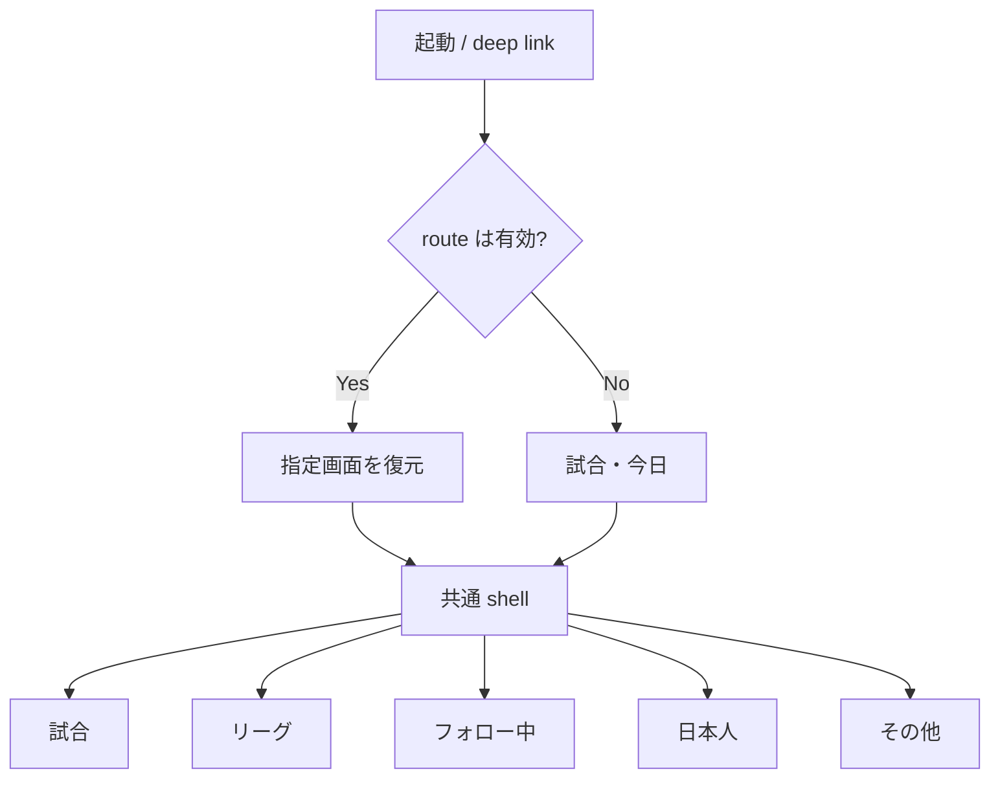
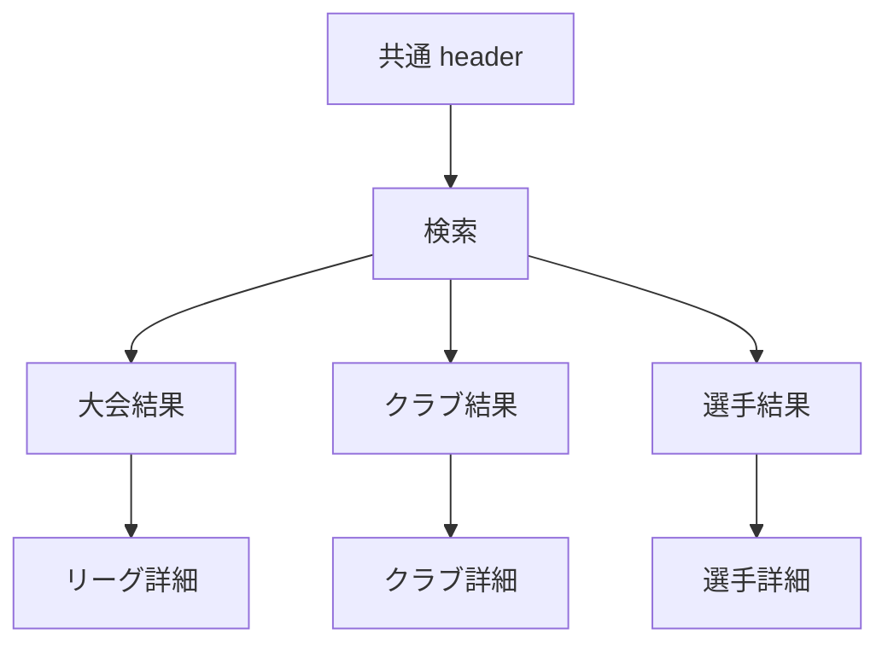
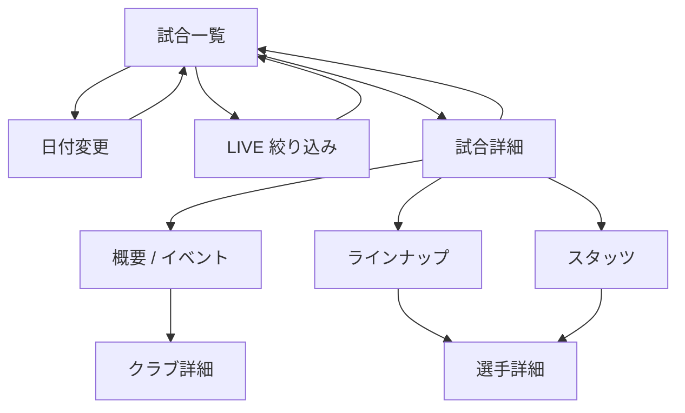
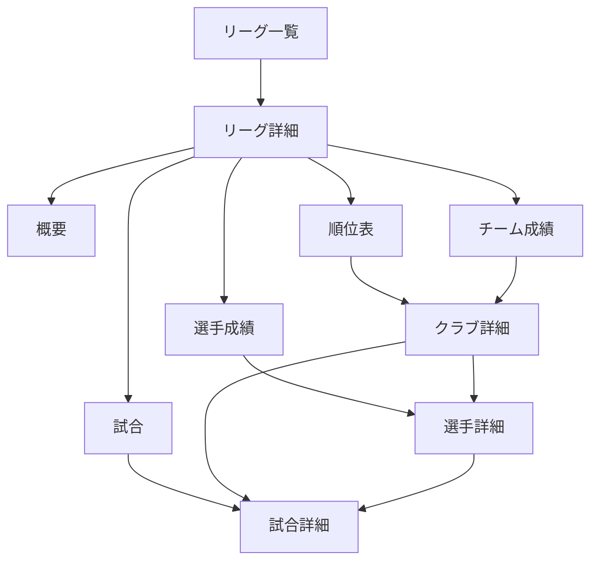
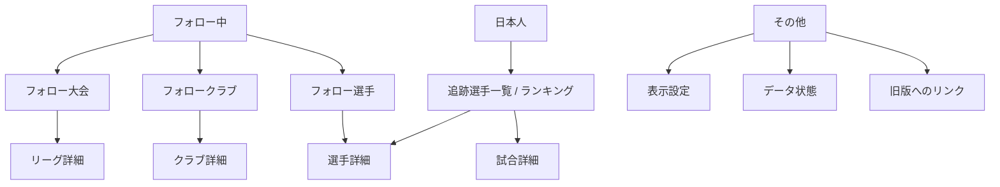

# Data App v2 画面遷移 v1.0（レビュー案）

状態: **Proposed — Claude レビュー完了まで実装禁止**
対象: D1/R2 移行後の Data App v2
作成日: 2026-08-26
関連文書: `data-app-v2-direction.md`、`data-storage-d1-r2-design-v1.0.md`

## 1. 目的

現行の5つの主ナビゲーションを維持しながら、試合・大会・クラブ・選手を Core facts で一貫して行き来できる画面構造を定義する。D1 と R2 のどちらから取得したかは画面遷移に影響させない。

実装済みの画面と、v2 方向性文書で必要だが未実装の画面を区別する。DB 移行の初回リリースは実装済み画面の parity を優先し、未実装画面を同時に作ることを切替条件にしない。

## 2. ルーティング方針

現行 `app-v2.js` はメモリ上の state だけで画面を切り替える。移行後は GitHub Pages でも直接開けて、ブラウザの戻る/進むが機能する hash route を画面 ID の正本とする。

| 画面 | Route | 状態 |
|---|---|---|
| 試合一覧 | `#/matches?date=YYYY-MM-DD&live=0` | 実装済み、route 化予定 |
| 試合詳細 | `#/fixtures/{fixtureId}?tab=overview` | 実装済み、route 化予定 |
| リーグ一覧 | `#/competitions` | 実装済み、route 化予定 |
| リーグ詳細 | `#/competitions/{competitionId}?season={seasonId}&tab=matches` | 一部実装済み |
| クラブ詳細 | `#/teams/{teamId}?season={seasonId}` | 未実装、Phase 2 |
| 選手詳細 | `#/players/{playerId}?season={seasonId}` | 未実装、Phase 2 |
| 共通検索 | `#/search?q={query}` | 未実装、Phase 2 |
| フォロー中 | `#/following` | shell 実装済み |
| 日本人 | `#/japanese?season={seasonId}` | legacy adapter で実装済み |
| その他 | `#/more` | 実装済み |

query parameter は選択状態を表し、データそのものを保持しない。path segment の canonical ID は `encodeURIComponent` 相当で符号化し、受信時に一度だけ decode する。不正または存在しない ID は空画面へ黙って落とさず、404 状態と戻り先を表示する。

## 3. 主ナビゲーション

下部ナビゲーションと desktop navigation は同じ5 destination を指す。詳細画面を開いている間も現在の主 destination を保持し、別 destination を押した場合はその destination の最後の一覧状態へ戻る。

共通 header の検索は6番目の主 destination にはせず、現在の戻り先を保持した overlay route とする。

## 4. 試合からの遷移

### 遷移規則

- 試合一覧は JST 日付を route に保存する。詳細から戻ると同じ日付、LIVE filter、scroll position を復元する。
- 詳細の tab は URL に保存し、再読込しても同じ tab を開く。
- `概要` はスコア、状態、イベントを表示する。イベント未取得とイベント0件を別表示にする。
- lineup の選手行は選手詳細、チーム名/ロゴはクラブ詳細へ遷移する。Phase 2 までは無効なリンクを置かない。
- archive 済み試合も同じ `#/fixtures/{fixtureId}` を開く。R2 読込中だけ通常の loading state を表示し、別画面には分岐しない。

## 5. リーグ・クラブ・選手の遷移

### リーグ詳細

- シーズン selector は route の `season` を変更し、tab は維持する。
- `試合` と `順位表` は現行実装の延長で Phase 1 に含む。
- `概要`、`選手成績`、`チーム成績` は Phase 2 とし、DB 切替の blocker にしない。
- 順位表の順位、勝点、試合数などで未取得の値を 0 と表示しない。

### クラブ詳細（Phase 2）

- 概要、試合、順位/大会、所属選手を表示する。
- 選手の current membership だけで過去試合を紐付けず、fixture 時点の team ID を使う。
- 追跡対象選手の club aggregate は現在クラブの粒度を使い、旧クラブ分を混ぜない。

### 選手詳細（Phase 2）

- 基本情報、現在所属、所属履歴、シーズン/大会/クラブ別集計、直近試合を表示する。
- 一般選手は Core facts だけを表示する。追跡対象選手の場合だけ日本人追跡 overlay と JFW Rating を追加する。
- player detail から fixture detail へ開いた後、戻ると元の選手・シーズン・scroll position を復元する。

## 6. フォロー中・日本人・その他

### フォロー中

- 認証導入前は competitions/teams/players の follow ID だけを `localStorage` に保存する。
- Core の試合データや集計をブラウザへ複製保存しない。
- ID が削除・統合された場合は「取得できないフォロー」として明示し、勝手に別 entity へ付け替えない。
- 端末間同期は認証設計後の別 Phase とする。

### 日本人

- 日本人画面は独立した facts store ではなく、Core player ID に紐づく `jfw_player_id` overlay を読む。
- ランキングは scope（season / competition）を明示する。
- 対象外移籍後も過去の tracked period と aggregate は残す。新しい対象外試合を自動追跡しない。
- 一般画面の試合詳細へ遷移し、同じ match facts を表示する。

### その他

- theme、データ更新時刻、取得状態、legacy link を表示する。
- 本番 Worker URL を利用者が通常操作で編集する UI は廃止し、build/config で固定する。開発用 override は query parameter または debug mode に限定する。
- API key、D1 ID、R2 bucket 名などの秘密/内部識別子を表示しない。

## 7. 画面と API の対応

| 画面 | Endpoint | 実装段階 |
|---|---|---|
| 試合一覧 | `GET /api/v2/dates/{date}` | Phase 1、既存互換 |
| LIVE | `GET /api/v2/live` | Phase 1、D1 scheduled data へ変更 |
| 試合詳細 | `GET /api/v2/fixtures/{fixtureId}` | Phase 1、D1/R2 透過 read |
| リーグ一覧 | `GET /api/v2/competitions` | Phase 1 で追加 |
| リーグ試合 | `GET /api/v2/competitions/{competitionId}/dates/{date}` | Phase 1、既存互換 |
| 順位表 | `GET /api/v2/competitions/{competitionId}/seasons/{seasonId}/standings` | Phase 1、既存互換 |
| リーグ概要 | `GET /api/v2/competitions/{competitionId}/seasons/{seasonId}` | Phase 2 |
| クラブ詳細 | `GET /api/v2/teams/{teamId}?season={seasonId}` | Phase 2 |
| クラブ試合 | `GET /api/v2/teams/{teamId}/fixtures?season={seasonId}&cursor=...` | Phase 2 |
| 選手詳細 | `GET /api/v2/players/{playerId}?season={seasonId}` | Phase 2 |
| 選手試合 | `GET /api/v2/players/{playerId}/fixtures?season={seasonId}&cursor=...` | Phase 2 |
| 日本人一覧 | `GET /api/v2/tracking/japanese?season={seasonId}` | Phase 1 後半 |
| 共通検索 | `GET /api/v2/search?q={query}&types=competition,team,player&limit=...` | Phase 2 |

一覧 endpoint は上限と cursor pagination を持つ。fixture detail 以外で大きい archive object をまとめて返さない。検索は最小文字数と最大件数を固定し、正規化名の exact/prefix index を使う。先頭 wildcard や任意 SQL 相当の検索条件は許可しない。

## 8. 取得状態と表示状態

| API 状態 | 画面表示 | 禁止事項 |
|---|---|---|
| 初回 loading | 対象領域の loading 表示 | 前画面の値を新しい ID の値として残さない |
| 空配列 + `present_empty` | 「該当なし」 | 「未取得」と表示しない |
| `not_fetched` | 「未取得」 | 0件、0、欠場へ変換しない |
| `provider_unavailable` | provider 側で利用不可 | 一般エラーと混同しない |
| archive loading | 通常の詳細 loading | archive 専用画面へ飛ばさない |
| 404 entity | 対象なし + 一覧へ戻る | 空の正常画面に見せない |
| 409/review required | データ確認中の注記 | 補正値で黙って上書きしない |
| 429 | 待機案内 + retry | API-Football quota の説明を利用者へ露出しない |
| 5xx/offline | 再試行 + 最終成功時刻 | 別日・別 entity の cache を代用しない |

古い request が遅れて返っても、現在の route ID と request sequence が一致しなければ state へ commit しない。これは現行の stale-request guard を全詳細画面へ一般化する。

## 9. 戻る・再読込・共有

- 一覧から詳細を開く直前に、route、filters、scroll position を session state に保存する。
- 画面内 back は `history.back()` を基本とし、履歴がない deep link では論理上の親 route へ `replace` する。
- ブラウザ再読込は hash route から同じ entity と tab を復元する。
- 存在しない season は現在 season へ黙って置換せず、利用可能な season とともに明示する。
- legacy 由来の `legacy:*` ID は移行期間だけ read-only で扱い、共有可能な恒久 ID として新規生成しない。

## 10. 実装順序

1. router と route-state の contract test
2. D1 backed の試合一覧、fixture detail、リーグ一覧/試合/順位表
3. 現行 Japanese view を Core player ID へ接続
4. follow ID の canonical 化と壊れた参照表示
5. club detail / player detail
6. 共通検索
7. league overview / player stats / team stats
8. 認証を採用する場合だけ follow sync

各段階で desktop/mobile navigation、戻る操作、deep link、stale request、missing state をテストする。

## 11. 画面受入条件

- 承認済み5 destination が desktop/mobile で一致する。
- 今日以外の日付から fixture を開いて戻っても、日付と filter が変わらない。
- fixture、competition、team、player の deep link が再読込できる。
- 検索から entity detail を開いて戻ると、query と結果位置が復元される。
- hot と archive の fixture detail が同じ表示 contract を満たす。
- 一般選手詳細は日本人 registry に依存せず表示できる。
- 追跡選手詳細は Core facts を複製せず overlay を追加する。
- `0`、未取得、非該当、空集合がそれぞれ正しく表示される。
- request race により別日/別 entity の結果が表示されない。
- legacy fallback は選択日以外の fixture を表示しない。
- DB 移行の Phase 1 は未実装の Phase 2 画面を理由に延期しない。
